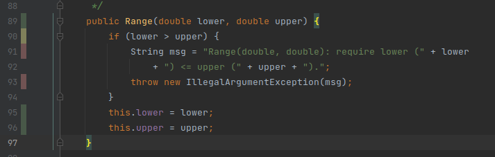
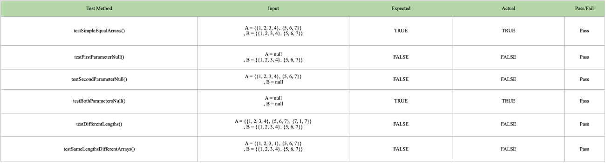
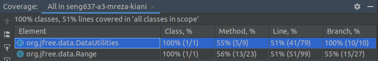
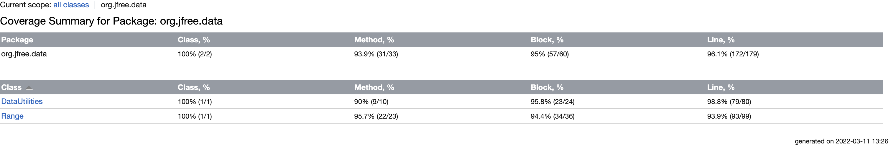
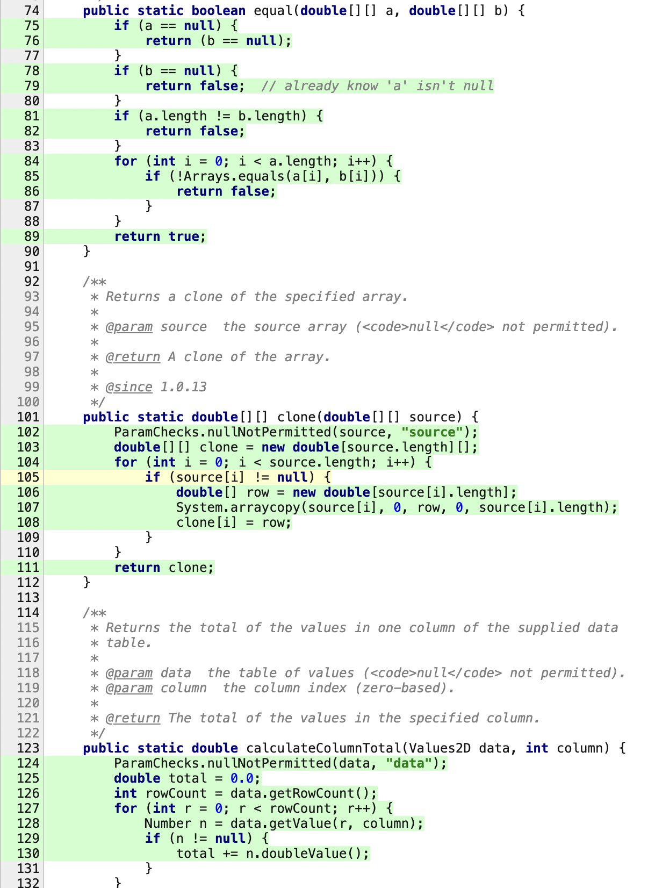

**SENG 637 - Dependability and Reliability of Software Systems**

**Lab. Report #3 – Code Coverage, Adequacy Criteria and Test Case Correlation**

| Group \#:              | 16  |
|------------------------|-----|
| Shahryar Soltanpour    |     |
| Mohammad Reza Kianifar |     |
| Muhammad Raihan        |     |

(Note that some labs require individual reports while others require one report
for each group. Please see each lab document for details.)

# Link of demo video

[Video Link](TODO://add-here-the-link-of-the-video)

It works for everyone with logged-in university account on outlook. Please [tell us](mailto:mohammadreza.kianifa@ucalgary.ca) if you had any problem.

# 1 Introduction

Text…

# 2 Manual data-flow coverage calculations for X and Y methods

Text…

# 3 A detailed description of the testing strategy for the new unit test

For reaching to more than 90% in line coverage, we wanted to do 2 things: 
1. Add new test cases for previous methods that didn't have 100% line coverage.
2. Add test cases for new methods to make them have 100% line coverage.

The approach is the same. We used the IntelliJ coverage tool that can show us the covered lines or branches within the 
number of hits they had. For each method, we saw the coverage hit map and then tried to add new test cases to cover all 
available lines. For conditions, we also tried to generate all possible cases of each term in that condition. The figure
bellow, shows an example of a previously covered method by black-box testing:

We can see 3 types of color for each line:
1. Green: Fully covered statement
2. Red: Unreached statement
3. Yellow: Partially covered condition. This happens when the condition has been true,
and only been passed.

So to make 100% line and branch coverage for this method, we added a new testCase with <i>lower > upper</i>.

By extracting the available branch for each method, and try to make the condition both true and false, we are able to go
for 100% line and branch coverage. We followed this technique to reach more than 90% of line coverage for both 
<i>Range</i> and <i>DataUtilities</i> classes.

# 4 A high level description of five selected test cases you have designed using coverage information, and how they have increased code coverage

We have added some new test cases for Range and DateUtilities class to increase our line, method and branch coverage. There were 4 out of 9 methods in DateUtilities class that were not tested in the previous assignment. One of them is the 'equal' method that checks if two given double[] arguments are equal or not. Here is a description of test cases written for this method:

# 5 A detailed report of the coverage achieved of each class and method (a screen shot from the code cover results in green and red color would suffice)
The first figure shows the coverage stats for the two classes before writing tests of this phase: 

The following figure shows code coverage stats for each tested class after completing this phase tests. Unfortunately, our coverage tool did not generate stats for each method, but you can see the green and red coverage lines for each class when you click on the class name in this [HTML generated file](./coverage-report/index.html). 

Here's a sample of the generated method coverage in the html report file:

# 6 Pros and Cons of coverage tools used and Metrics you report

We used IntelliJ built-in coverage tool for extracting coverage information. After we set it up, we saw that it doesn't 
have branch and condition coverages. After searching for the solution, we find a technique that IntelliJ tool could give
us branch coverage, but still we didn't have condition coverage. So we switched to Eclipse IDE and used EclEmma plugin
for coverage. Again, the result was same and this tool also didn't show us condition coverage. After that, we decided to 
return to IntelliJ IDE since our team has more experience in working with that, and we used method coverage metric instead.

The pros of using the coverage tools are:
1. Trying to find uncovered statements/branches. So it helps you to provide new tests that are both necessary and more effective.
2. By trying to reach 100% statement/branches coverage, it's possible that you find new bugs in the code. As we find a new bug in Range class for CombineIgnoringNaN method. When we tried to combine to range with upper bound NaN values, the result wasn't as we expected. (You can see [aCombinationWithUpperBondNaNValue test CombineIgnoringNaNMethodTest file](./test/org/jfree/data/range/CombineIgnoringNaNMethodTest.java) for more information)
3. By trying to reach 100% statement/branches coverage, you may find some lines that are infeasible to reach. So, it helps you to refactor your code by removing those lines.
4. These coverage tools can produce high level reports in different formats like HTML that can help you to see your testing performance.
5. These are built-in tools in the IDE, so there is no need for you to install new software.

The cons of using the coverage tools:
1. It may take a while from you to set up the tool and extract required metrics from that. Especially, if it's your first time. But after that, you can work with them in a more straightforward manner.
2. The IntelliJ built-in coverage plugin, EclEmma, and JaCoCo tools doesn't have Condition Coverage metric.
3. You may end up with some dummy test cases only to reach 100% coverage, like testing getters/setters.

We used 3 metrics for our coverage report: Statement Coverage, Branch Coverage, and Method Coverage. Although, what we said earlier is also true for these metrics, but if we want to speak individually, we can say:

Pros of statement coverage:
1. It helps you to detect the statements that have been already covered or vice-versa. So you can easily detect what new test cases are necessary.
2. You can detect unreachable statements, and perform refactor.
3. This metric ensures all the statements actually perform the task that they should ideally be performing by checking each line of the code.

Cons of statement coverage:
1. It doesn't show you information about conditions. So, you can not sure what terms are covered.
2. This is also true for loop ending condition. This metric doesn't show if that has actually happened or not.

Pros of branch coverage:
1. The branches are the things that makes your code more complicated since they don't follow a simple path anymore, and you are dealing with a tree. This metric helps you to make sure you've reached every node of that tree with your testcases.
2. This metric helps to measure which decision outcomes have been tested and which not.

Cons of branch coverage:
1. In some conditions, you may have more than one term combined with &&/||/!. So it's complicated to figure our have you covered all of them or not. Although, IntelliJ has a tool that can show you number of hits per term and that helped us.

Pros of method coverage:
1. Gives you an abstract view about how many methods have you covered with your test cases.

# 7 A comparison on the advantages and disadvantages of requirements-based test generation and coverage-based test generation.

Text…

# 8 A discussion on how the team work/effort was divided and managed

Text…

# 9 Any difficulties encountered, challenges overcome, and lessons learned from performing the lab

Text…

# 10 Comments/feedback on the lab itself

Text…
